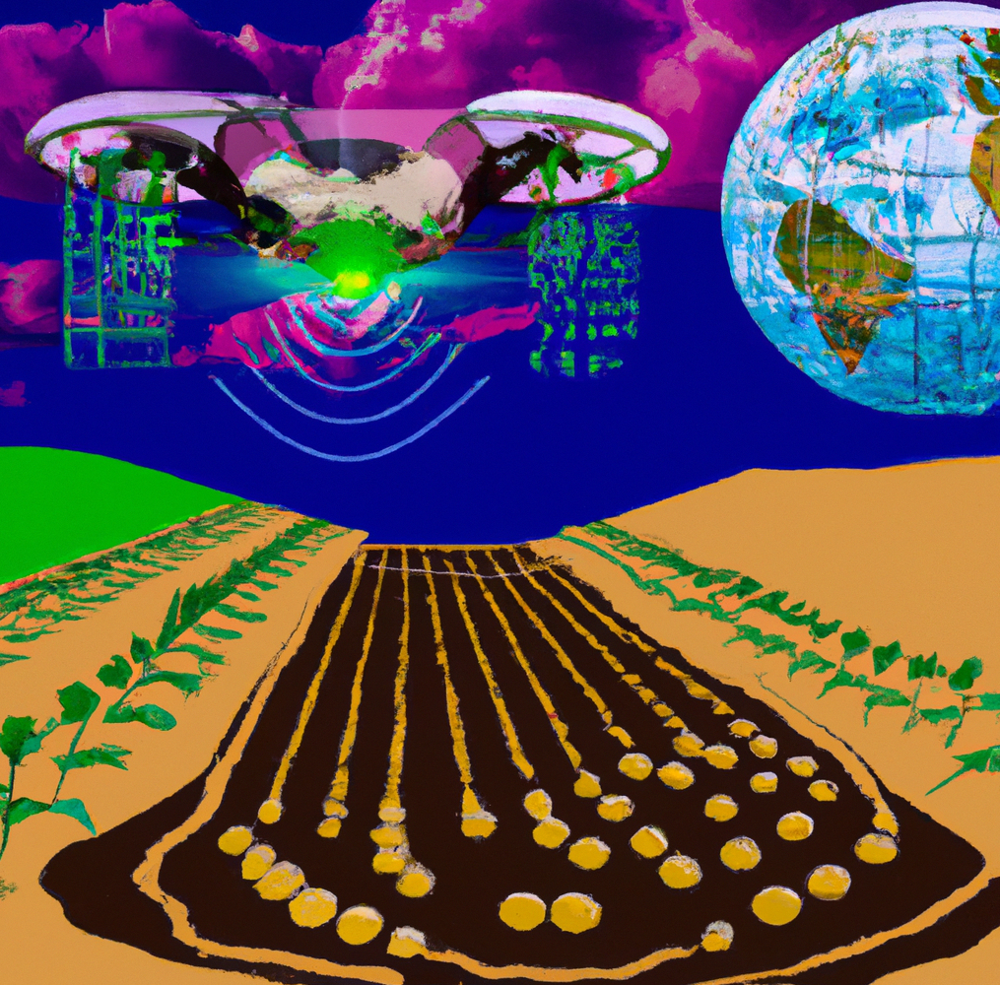

# DPI-coding-resources

## TOC  

- [DPI-coding-resources](#dpi-coding-resources)
  * [TOC](#toc)
  * [Introduction](#introduction)
  * [Coding IDE's](#coding-ide-s)
  * [AI code frameworks](#ai-code-frameworks)
  * [AI training cloud computing frameworks](#ai-training-cloud-computing-frameworks)
  * [Computer vision training notebooks](#computer-vision-training-notebooks)
  * [Training guides](#training-guides)
  * [Camera trap automation](#camera-trap-automation)
  * [Pre-trained models](#pre-trained-models)
  * [Dead tree learning resources](#dead-tree-learning-resources)
  * [AI conversion tools and utilities](#ai-conversion-tools-and-utilities)
  * [Remote sensing](#remote-sensing)
    + [Data](#data)
    + [Drones](#drones)
    + [Satellite](#satellite)
  * [Other really good learning resource repos](#other-really-good-learning-resource-repos)
  * [DPI staff repos](#dpi-staff-repos)
  * [Upcoming courses](#upcoming-courses)

<small><i><a href='http://ecotrust-canada.github.io/markdown-toc/'>Table of contents generated with markdown-toc</a></i></small>

## Introduction  
A shared set of resources for coding, ML/AI, biometrics and bioinformatics. Pull requests are welcome as I hope this repository can become a shared body of work!   

New to git? I won't lie, the learning curve is reasonably steep, but `git pull` and `git push` is really all you need to get started. Once you have a handle on that then try branching, which is an awesome way of testing code without breaking anything in your working branch. Also, don't neglect your `README.md` files; do your future self a favour (at least) and make it easy to understand your code. The github [learning resources for git are here](https://github.com/git-guides).  

If you are new to markdown [here is githubs markdown cheatsheet](https://github.com/adam-p/markdown-here/wiki/Markdown-Cheatsheet). Markdown can be easily converted to PDF/HTML/DOCX so its a great way of documenting in general and it can be version controlled (unlike MS word).     

## Coding IDE's    
- [VIM!!!](https://www.vim.org/)
- [You really should be using Anaconda](https://www.anaconda.com/products/distribution)
- [R studio](https://en.wikipedia.org/wiki/RStudio)
- [visual studio](https://code.visualstudio.com/)
- [spyder](https://www.spyder-ide.org/)

## AI code frameworks  
- [Tensorflow2 (python)](https://www.tensorflow.org/tutorials/quickstart/beginner)
- [Keras (python)](https://keras.io/)
- [h2o (python/R)](https://h2o.ai/)
- [Yolo docker image](https://github.com/ultralytics/yolov5/wiki/Docker-Quickstart)
- [GroundingDINO an openset object detector based on natural language prompts](https://github.com/IDEA-Research/GroundingDINO)

## AI training cloud computing frameworks  
- [I have a personal subscription to Google colab and it is well worth the dosh](https://colab.research.google.com/)
- [My guess is that DPI will likely partner with Azure for cloud computing in the future](https://azure.microsoft.com/en-au)
- [If you have a google account you have access to Google compute (well worth it if you want to dabble in cloud VMs)](https://cloud.google.com/compute)
- [AWS](https://aws.amazon.com/free/?trk=f181118c-0869-454a-84d2-63d0cf7146e3&sc_channel=ps&s_kwcid=AL!4422!3!638125895456!e!!g!!aws&ef_id=Cj0KCQiA8aOeBhCWARIsANRFrQHlHuQEGtcbEhbitpeLgPixLBLXlilRFYkeC998yq7ExTsAC1jT-U8aAp0pEALw_wcB:G:s&s_kwcid=AL!4422!3!638125895456!e!!g!!aws&all-free-tier.sort-by=item.additionalFields.SortRank&all-free-tier.sort-order=asc&awsf.Free%20Tier%20Types=*all&awsf.Free%20Tier%20Categories=*all)
- [Google computer vision AI portal](https://cloud.google.com/vision/)

## Computer vision training notebooks  
- [Roboflow training notebooks mostly focused on the yolo framework (including v8)](https://github.com/roboflow/notebooks)
- [Syndey Uni informatics hub demo](https://github.com/Sydney-Informatics-Hub/cv-demo)
- [Everything YOLO related](https://github.com/hlydecker/yolov5)
- [Tracking and counting objects using Yolov8 (video)](https://www.youtube.com/watch?v=OS5qI9YBkfk)
- [Tutorial on training a yolov5 model](https://github.com/ultralytics/yolov5/wiki/Train-Custom-Data)

## Training guides  
- [Training a custom object detector using transfer learning](https://tensorflow-object-detection-api-tutorial.readthedocs.io/en/latest/training.html)
- [You crazy fool: good guide on using R for AI/ML](https://github.com/hlydecker/MLWIC)
- [Data wrangling challenges for R diehards](https://www.r-bloggers.com/2023/03/data-wrangling-tricks-from-the-r4ds-slack/)

## Camera trap automation  
- [MS megadetector v5 (yolo arch) running in a OS independent docker container](https://github.com/Sydney-Informatics-Hub/megadetector-contained)
- [Marsupial.ai: Australia-centric camera trap animal detection from Sydney Uni informatics hub](https://github.com/Sydney-Informatics-Hub/marsupial)
- [U-fuse camera trap pipeline for windows/linux with a GUI!](https://github.com/u-infuse/u-infuse)

## Pre-trained models  
- [Tensorflow2 Model zoo](https://github.com/tensorflow/models/blob/master/research/object_detection/g3doc/tf2_detection_zoo.md)
- [Weeds AI models for weed detection via UofSyd](https://github.com/hlydecker/Weed-AI)
- [AI for Earth megadetector repo](https://github.com/hlydecker/CameraTraps)
- [Deep weeds: AI based weed detection (Australian)](https://github.com/hlydecker/DeepWeeds)

## Dead tree learning resources  
- [Simply the best book ever: Hands-on Machine learning with Scikit-learn, keras, and Tensorflow](https://www.amazon.com.au/Hands-Machine-Learning-Scikit-Learn-TensorFlow/dp/1492032646/ref=asc_df_1492032646/?tag=googleshopdsk-22&linkCode=df0&hvadid=341743255824&hvpos=&hvnetw=g&hvrand=6660020724196997058&hvpone=&hvptwo=&hvqmt=&hvdev=c&hvdvcmdl=&hvlocint=&hvlocphy=1000286&hvtargid=pla-523968811896&psc=1)

## AI conversion tools and utilities  
- [chatGTP for text related tasks](https://openai.com/blog/chatgpt/)
- [DALL-E (image related tasks)](https://openai.com/blog/dall-e/)
- [AI based code completion via co-pilot (might breach open source coding licenses)](https://github.com/features/copilot)
- [coco_solaris: geojson and image file to COCO format](https://github.com/Sydney-Informatics-Hub/coco_solaris)
- [labelme: flexible boundary box and labeling tool](https://github.com/hlydecker/labelme)

## Remote sensing   

### Data  
- [DataharvesteR: Preprocess, aggregate, visualise and download geospatial data from a range of Australian (and international) data sources](https://github.com/Sydney-Informatics-Hub/dataharvester)
### Drones  
In my experience you need <1cm/px resolution to get reliable image detection for plant based IDs.  

### Satellite   
If you work at DPI/DPE you can request access to [Planet](https://www.planet.com/) which offers standard 3m/px resolution imagery of NSW and 60cm/px on special request.  
- [Automatic segmentation of satellite imagary](https://samgeo.gishub.org/#demos)

## Other really good learning resource repos
- [good repo covering coding, web, data-science](https://github.com/lauragift21/awesome-learning-resources)
- [Sydney Uni's Informatics Hub github page of resources](https://github.com/Sydney-Informatics-Hub)

## Online Tools
- [automatic TOC generation for Markup docs](https://ecotrust-canada.github.io/markdown-toc/)

## DPI staff repos
- [Camera-trap detection using marsupial.ai as a docker container](https://github.com/dwheelerau/marsupial-contained)
- [Step-by-step guide to using docker on windows](https://github.com/dwheelerau/docker-guide)
- [Camera-trap detection using megadetector as a docker congtainer](https://github.com/dwheelerau/megadetector-contained)

## Upcoming courses 
